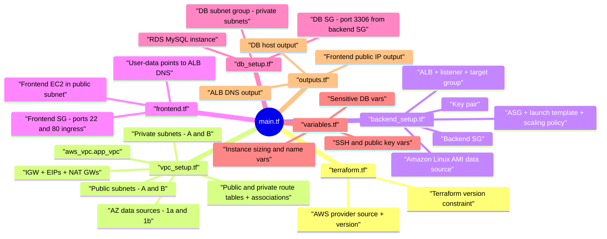

# Terraform AWS Setup - Repository Guide

This repository provisions a small AWS application stack with:
- A custom VPC across 2 Availability Zones
- Public and private subnets
- Internet + NAT egress design
- An internet-facing ALB
- Backend EC2 instances managed by an Auto Scaling Group
- A standalone frontend EC2 instance
- A private MySQL RDS instance

The goal of this README is to help you understand what each Terraform file does and how they connect.

## Mind Map (root: `main.tf`)



## File-by-file walkthrough

### `main.tf`
- Defines the AWS provider block and target region (`us-east-1`).
- Serves as the entry point context for the configuration set.
- Mostly comments and Terraform learning notes; no resources are declared here.

### `terraform.tf`
- Configures Terraform itself:
  - `required_providers.aws` from `hashicorp/aws` with version `~> 5.92`
  - `required_version = ">=1.2"`
- No infrastructure resources; this file controls tooling compatibility.

### `vpc_setup.tf`
Defines all core networking.

Resources and data sources:
- `aws_vpc.app_vpc`
- `data.aws_availability_zone.az-a`
- `data.aws_availability_zone.az-b`
- `aws_subnet.public_subnet_a`
- `aws_subnet.private_subnet_a`
- `aws_subnet.public_subnet_b`
- `aws_subnet.private_subnet_b`
- `aws_internet_gateway.app_vpc_ig`
- `aws_eip.eip_a`
- `aws_eip.eip_b`
- `aws_nat_gateway.nat_a`
- `aws_nat_gateway.nat_b`
- `aws_route_table.public_subnet_rt`
- `aws_route_table.private_subnet_a_rt`
- `aws_route_table.private_subnet_b_rt`
- `aws_route_table_association.public_subnet_a_rt_association`
- `aws_route_table_association.public_subnet_b_rt_association`
- `aws_route_table_association.private_subnet_a_rt_association`
- `aws_route_table_association.private_subnet_b_rt_association`

What it builds:
- A VPC `10.0.0.0/16`
- 4 subnets split across `us-east-1a` and `us-east-1b`
- Public egress through IGW for public subnets
- Private subnet outbound internet access through per-AZ NAT gateways

### `backend_setup.tf`
Defines backend compute and traffic entry.

Resources and data sources:
- `data.aws_ami.amazon_linux`
- `aws_key_pair.app_key_pair`
- `aws_lb_target_group.lb_target_group`
- `aws_security_group.lb`
- `aws_lb.app_lb`
- `aws_lb_listener.app_lb_listener`
- `aws_launch_template.launch_templ`
- `aws_autoscaling_group.auto_sc_group`
- `aws_autoscaling_policy.cpu_usage`
- `aws_autoscaling_attachment.asg_lb_link`
- `aws_security_group.backend_sg`

What it builds:
- Internet-facing Application Load Balancer in both public subnets
- HTTP listener on port 80 forwarding to target group
- Launch template for backend instances (user-data from `backend-script-setup.tftpl`)
- Auto Scaling Group in private subnets (min 2, desired 2, max 4)
- Target tracking scaling policy on average CPU
- Security model where backend accepts HTTP only from the ALB security group

### `frontend.tf`
Defines a separate frontend instance and its security group.

Resources:
- `aws_instance.frontend_server`
- `aws_security_group.frontend_sg`

What it builds:
- One public EC2 frontend host in `public_subnet_a`
- Public IP attached
- User-data generated from `frontend-script-setup.tftpl`, with backend ALB DNS injected
- Inbound rules for SSH (22) and HTTP (80) from `0.0.0.0/0`

### `db_setup.tf`
Defines the database layer.

Resources:
- `aws_db_subnet_group.db`
- `aws_security_group.db`
- `aws_db_instance.db`

What it builds:
- RDS subnet group spanning private subnets
- DB security group that allows MySQL (3306) only from backend security group
- Private MySQL RDS instance (`publicly_accessible = false`)

### `variables.tf`
Defines configurable inputs for the stack.

Notable variables:
- EC2 settings: `instance_name`, `instance_type`
- SSH/key path settings: `ssh_key`, `public_key`
- Bootstrap helper values: `ec2_init_log_file`, `ec2_custom_user`
- Sensitive DB inputs: `db_username`, `db_passwd`, `db_name`

### `outputs.tf`
Defines useful post-apply values:
- `load_balancer_dns`
- `frontend_ssh` (frontend public IP)
- `db_host` (RDS endpoint)

## How the pieces connect

1. Networking comes first (`vpc_setup.tf`) to provide VPC, subnets, routing, and NAT.
2. Backend components (`backend_setup.tf`) use that networking:
   - ALB in public subnets
   - ASG instances in private subnets
3. Frontend instance (`frontend.tf`) is public and calls the backend through ALB DNS.
4. Database (`db_setup.tf`) stays private and is reachable from backend instances only.
5. Outputs expose key runtime endpoints.

## Quick apply flow

```bash
terraform init
terraform validate
terraform plan
terraform apply
```

If variables are not provided via `*.tfvars` or environment variables, you will need to set at least:
- `db_username`
- `db_passwd`
- `db_name`

## Notes

- Terraform loads all `.tf` files in this directory as one configuration.
- Template files (`*.tftpl`) are used for EC2 bootstrap scripts.
- State files (`terraform.tfstate*`) contain real infrastructure metadata and should be handled carefully.
